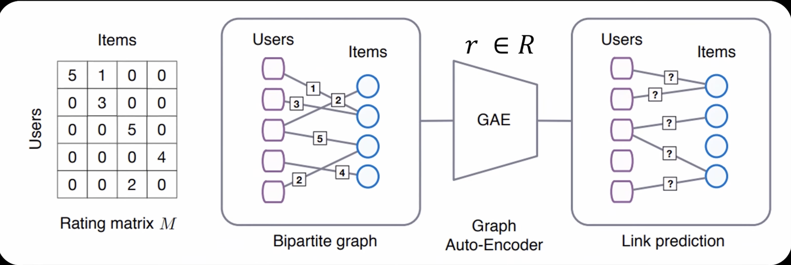

# Research Proposal: Book Recommender System with Graph Neural Networks (GNNs)

### Datasets

- The data that we are going to use in the project is coming from this Kaggle dataset: [Book Recommendation Dataset](https://www.kaggle.com/datasets/arashnic/book-recommendation-dataset/data).

- In this project we are going to use three different datasets:
  1. Books.csv
      - Contain the different information about books, like their ISBN number, Author, Title and Publisher. However, it does not include any summary or information about the content of the book (apart from the title).
  2. Rating.csv
      - This dataset contains the ratings that different users gave to books. We are probably going to merge the books and ratings data sets based on their ISBN number.
  3. Users.csv
      - This dataset contains the users IDs, their locations, and their age. We are going to use this information as further data to recommend books to users, with a similar background.

### Research Question
  - **How can Graph Neural Networks (GNNs) enhance a reccomendation system for books based on user-based collaborative filtering?**

### Objectives

### Graph Structure

- This is a basic structure for the GNN that we are aiming to use:

1. **Nodes:**
    - **User Nodes:** Represent users, each associated with features such as user ID, age, and location.
    - **Item Nodes:** Represent books, each associated with features such as ISBN, title, author, publisher, year of publication, and genre.

2. **Edges:**
    - **User-Item Edges:** Represent interactions between users and books (ratings). The edge weight can be the rating value given by the user to the book.
    - **User-User Edges:** Represent similarities between users based on demographic information or common book ratings.
    - **Item-Item Edges:** Represent similarities between books based on metadata such as title, author, publisher.

#### Evaluation Metrics 
- As outlined in this article [Evaluating Recommender Systems](https://medium.com/nerd-for-tech/evaluating-recommender-systems-590a7b87afa5), for the evaluation metrics we aim to use:
    1. **Root mean square error (RMSE)**
    2. **Average reciprocal hit rate (ARHR)**
- We are also going to look at the top N predictions for a specific user. We aim to compare our results with a baseline model such as Support Vector Machine or other collaborative filtering methods. Thus by comparing our GNN results against these models we will be able to determine the performance of our model.
  - We are going to take these comparison/base-line models from Kaggle projects on the same Dataset.